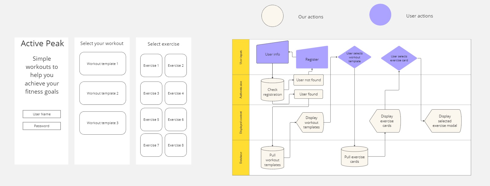

# Active-Peak
-yellow)
-orange)
-blue)
-lightblue)
-purple)

- A fitness manager app for enthusiasts to connect by sharing workout routines, posting progress pictures, and finding exercises tailored to their needs!

## Description

- My motivation for building this application was driven by a passion for empowering individuals to take control of their fitness journeys in a personalized and supportive environment.
- This project was built to provide users with personalized workout routines, a platform to share progress pictures, and a community to foster motivation and engagement.
- This solves the problem of finding suitable workout routines tailored to individual demographics and offers a supportive environment for sharing fitness achievements.
- In this project, we learned the importance of creating a user-friendly interface and the impact of a supportive community on maintaining fitness motivation.

## Table of Contents (Optional)

Here is a table of contents to make it easy for users to locate which section they need.

- [Installation](#installation)
- [Usage](#usage)
- [Credits](#credits)
- [License](#license)

## Installation

You'll need to install GitBash, VS Code, Node.js, NPM bcrypt, NPM connect-session-sequelize, NPM dayjs, NPM express-handlebars, NPM express-session, NPM dotenv, NPM pg, NPM sequelize, NPM Axios, Express, PostgreSQL, and Nodemon. From here you will need knowledge on how to clone a repo from GitHub over to your device to store it locally. Once its stored locally on your device you can open VSCode (IDE). Lastly once VSCode is running, open the CLI (Command-Line-Interface), type npm install for the node_modules packages, establish the database using postgreSQL, and then run the server using NPM run dev. Once you've done this the website will be deployed locally for testing, debugging, and developing.

## Usage

The Active Peak fitness manager is perfect for fitness enthusiasts and professionals who want to stay engaged and motivated. This platform allows users to post pictures, share their fitness journeys, and find workout routines tailored to their specific demographics. Whether you are looking to showcase your progress, discover new exercises, or connect with like-minded individuals, the Active Peak fitness manager provides the ideal space to enhance your fitness experience.

- <strong>Active Peak Link</strong>

- [Website-Link](N/A)

- <strong>Active Peak Screenshots</strong>

- 
- [Screenshot](N/A)
- [Screenshot](N/A)
- [Screenshot](N/A)
- [Screenshot](N/A)

## Support

N/A

## Credits

People who worked on this project were Brennan Waterbury, David Pippin, Robert Maxfield, and Brett Czerwinski. You can contact the contributors through the GitHub profiles links listed here.
- <a href="https://github.com/bwater47" alt="GitHub Link">GitHub Profile - Brennan Waterbury</a>
- <a href="https://github.com/dpippin09" alt="GitHub Link">GitHub Profile - David Pippin</a>
- <a href="https://github.com/grawrb" alt="GitHub Link">GitHub Profile - Robert Maxfield</a>
- <a href="https://github.com/Bcz25" alt="GitHub Link">GitHub Profile - Brett Czerwinski</a>

## License

- 
- This is an [https://choosealicense.com/licenses/mit/](https://choosealicense.com/licenses/mit/) license.

## Features

<strong>Fitness Management Platform</strong>: Empowers users to seamlessly organize their fitness routines, monitor progress, and access personalized workout plans—all without the inconvenience of hiring a trainer or setting up a backend infrastructure.

## Contributing

Contributing is allowed if you're in the U of U Coding Bootcamp. Contact us on the slack channel for information. 
- [Contributor Covenant](https://www.contributor-covenant.org/)

## Authors and Acknowledgment

Handlebars. (06/06/24). https://handlebarsjs.com/ 

Sequelize V6. Sequelize. (06/06/24). https://sequelize.org/docs/v6/ 

Documentation. PostgreSQL. (06/06/24). https://www.postgresql.org/docs/ 

The Collaborative API Development Platform. Insomnia. (06/06/24). https://insomnia.rest/ 

Routing. Express routing. (06/06/24). https://expressjs.com/en/guide/routing.html#express-router 

NPM docs. npm Docs. (06/06/24). https://docs.npmjs.com/ 

CLI commands. npm Docs. (06/06/24). https://docs.npmjs.com/cli/v10/commands

Node.js V22.0.0 documentation. Command-line API | Node.js v22.0.0 Documentation. (06/06/24). https://nodejs.org/api/cli.html

MozDevNet. (06/06/24). Resources for developers, by developers. MDN Web Docs. https://developer.mozilla.org/en-US/ 

Bootcamp Spot. (06/06/24). https://bootcampspot.com/

W3Schools Online Web Tutorials. (06/06/24). https://www.w3schools.com/

Chatgpt. ChatGPT. (06/06/24). https://openai.com/chatgpt

• Please note: While ChatGPT was utilized to generate dialog content for the README file, it was not involved in the generation of any code, HTML edits, CSS edits, or other assets within the repository apart from this README specifically.

• All other sources, links, and information utilized within the project were obtained from the provided sources mentioned in this paragraph. This includes class materials, modules, TA guidance, instructor-provided resources, as well as communication through platforms such as Slack or Discord. Additionally, numerous links and resources were provided within the assignment instructions and demonstrated during class sessions.

## Roadmap

Tests: N/A

## Project status

In-Progress